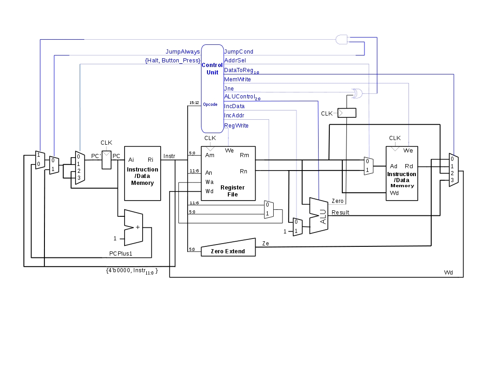
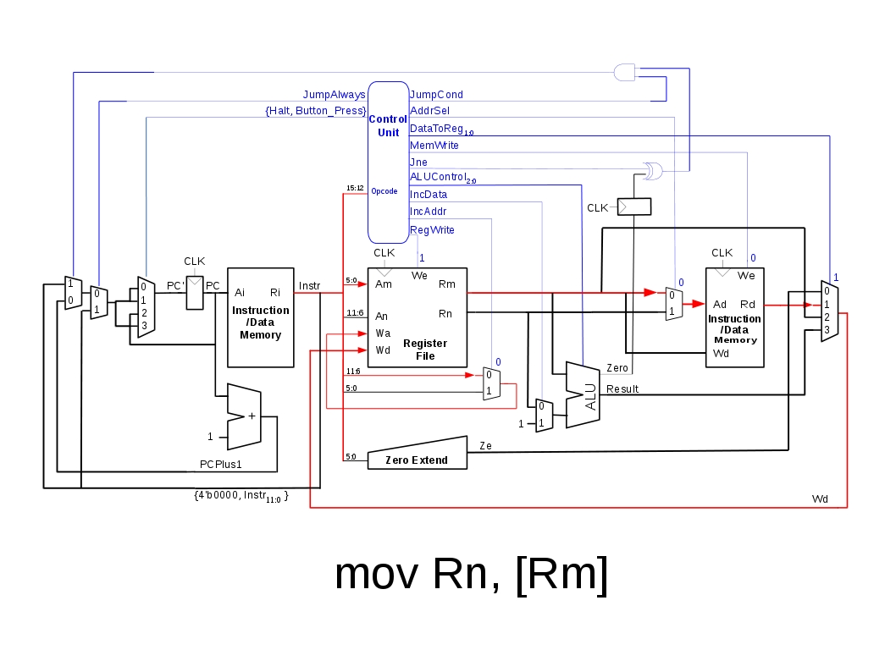

# Lab 1 Readme
### Maj(s) Ryan J. Silva
### Yunpeng Wang

References: 
- All figures modified from *Harris and Harris, Digital Design and Computer Architecture 2nd Edition, Morgan-Kaufmann 2013*
- Processor verilog code modified from the MIPS example in *ibid*
- The VGA control verilog code modified from *Chu, Pong P, FPGA Prototyping By Verilog Examples: Xilinx Spartan 3 Version, Wiley 2008* 

## Top-level schematic

### Component Descriptions

#### Instruction/Data Memory
- 16x4096 Dual-Read Single-Write Block RAM
  - Dual Read Ports: 
    - Separate inputs for instruction address (**Ai**) and data address (**Ad**)
    - Separate outputs for instruction data (**Ri**) and Read/Write data (**Rd**)
  - Single Write Port:
      - Will write data from **Wd** to memory address **Ad** when write enable (**We**) is high

#### Register File
- 16x6 Dual-Read Single-Write Register File
  - Dual Read Ports:
    - Separate inputs addressing Rm and Rn per the ISA
  - Single Write Port:
    - Will write data from **Wd** to **Wa** when write enable (**We**) is high

#### Zero Extend
- Used for the **mov Rn, num** instruction
  - Device will pad the lower 6 bits of the 16-bit instruction with zeros in order to properly load the immediate value *<num>* into the register specified by the *Rn* field

#### ALU^

^Copyright 2007 Elsevier 

- Design taken from *Harris and Harris, Digital Design and Computer Architecture 2nd Edition, 2013*
- Performs arithmetic operations on inputs A and B based on the 3-bit control input ALUControl

| ALUControl(2:0) | Operation |
| :-: | :-: |
| 000 | A and B |
| 001 | A or B |
| 010 | A + B |
| 011 | unused |
| 100 | A and ~B |
| 101 | A or ~B |
| 110 | A - B |
| 111 | Set Less Than |

#### Control Unit
- Modifies control signals based on the 4-bit opcode (the most significant 4 bits of the instruction, i.e. Instr(15:12)) 
- Note: There is **no functional difference between sadd and add.**
  - Signed addition is performed using the **exact same** hardware as unsigned addition (hence the power of two's complement)
  - Since the **cmp Rn, Rm** instruction is only used for **jne** and **je** instructions there is no need to change the microarchitecture to account for the introduction of signed addition (i.e. you don't need to interpret the output of a signed vs unsigned adder to compute whether two numbers are equal)

| Mnemonic | Opcode | RegWrite | MemWrite | AddrSel | DataToReg | Halt | ALUControl | IncAddr | IncData | JumpAlways | JumpCond | JNE |
| :-: | :-: | :-: | :-: | :-: | :-: | :-: | :-: | :-: | :-: | :-: | :-: | :-: |
| mov Rn, [Rm] | 1100 | 1 | 0 | 0 | 01 | 0 | XXX | 0 | 0 | 0 | 0 | 0 |
| mov [Rn], Rm | 1011 | 0 | 1 | 1 | XX | 0 | XXX | X | 0 | 0 | 0 | 0 |
| mov Rn, num | 1001 | 1 | 0 | X | 00 | 0 | XXX | 0 | 0 | 0 | 0 | 0 |
| mov Rn, Rm | 1010 | 1 | 0 | X | 10 | 0 | XXX | 0 | 0 | 0 | 0 | 0 |
| halt | 0000 | 0 | 0 | X | XX | 1 | XXX | X | 0 | 0 | 0 | 0 |
| add Rn, Rm | 0101 | 1 | 0 | X | 11 | 0 | 010 | 0 | 0 | 0 | 0 | 0 |
| sub Rn, Rn | 0110 | 1 | 0 | X | 11 | 0 | 110 | 0 | 0 | 0 | 0 | 0 |
| xor Rn, Rm | 0111 | 1 | 0 | X | 11 | 0 | 001 | 0 | 0 | 0 | 0 | 0 |
| cmp Rn, Rm | 1000 | 0 | 0 | X | 11 | 0 | 110 | 0 | 0 | 0 | 0 | 0 |
| sadd Rn, Rm | 1101 | 1 | 0 | X | 11 | 0 | 010 | 0 | 0 | 0 | 0 | 0 |
| inc Rn | 0001 | 1 | 0 | X | 11 | 0 | 010 | 1 | 1 | 0 | 0 | 0 |
| jmp <target> | 0010 | 0 | 0 | X | XX | 0 | XXX | X | X | 1 | 0 | 0 |
| je <target> | 0100 | 0 | 0 | X | XX | 0 | XXX | X | X | 0 | 1 | 0 |
| jne <target> | 0011 | 0 | 0 | X | XX | 0 | XXX | X | X | 0 | 1 | 1 |

### Example Data Flows 
Instruction-Specific Data Flows are Highlighted in Red in the Figures Below

#### *halt*

The datapath for the *halt* instruction is highlighted in red in the above picture.

In the absence of a *jump* or *halt* instruction, the Program Counter would take on the value of the Program Counter plus one (**PCPlus1**) every clock cycle. In the case of a *halt* instruction, the Program Counter should take on the value of the current program counter and, thus, linger on the current instruction until a button is pushed. This functionality is achieved through the use of a 4-1 mux, using the **Halt** control signal concatenated with the debounced button press as select lines.

The figure shows that the Program Counter will maintain its current value so long as the **Halt** control signal is asserted AND the button has not been pressed.

#### *add Rn, Rm*

As shown in the above figure, the *add* instruction parses the 16-bit instruction by reading bits 5:0 of the 16-bit instruction as the address of the Rm register operand. Similarly, bits 11:6 are read as the address of the Rn register operand. The data from each of these registers is routed to the ALU, with the Rn data passing through a multiplexor, which is used to account for the *inc* instruction. The ALUControl signal is set to 010, which corresponds to an *add* operation as dictated by the control table listed in the ALU section above. 

The result of the ALU is routed through another multiplexor, which chooses the data to be written to the register file. This choice is made between the output of the zero extend module (for the *mov Rn, num* instruction), the output of memory (for the *mov Rn, [Rm]* instruction), the Rm output of the register file (for the *mov Rn, Rm* instruction) and, finally, the output of the ALU (for all ALU-based operations). Additionally, a choice must be made as to which address of the register file the data is written to, either Rn or Rm. This choice is made using a multiplexor controlled by the **IncAddr** control signal. 

#### *inc Rn*

The increment instruction is similar to the ALU-based *add* instruction described above. The difference between the two instructions lies in the input to the ALU (controlled by a mux with **IncData** select) and the register to be written to (controlled by a mux with **IncAddr** select). The only non-intuitive design consideration for the *inc Rn* instruction is that the bit field representing the register *Rn* normally corresponds to bits 11:6 of the Instr signal. The *inc Rn* instruction breaks this consistency by assigning register number to bits 5:0 of the Instr signal, which is accounted for by the IncAddr mux. 

#### *je <target>*

The *je* instruction is complex in the amount of control hardware it utilizes. The instruction should load a target address into the PC if the previous operation asserted the zero flag of the ALU. The flip flop connected to the **Zero** output of the ALU stores the state of the zero flag for the next instruction. Therefore, if the Q output of the zero flag flip flop is asserted and the **jne** control signal is not asserted, the output of the *XOR* gate will produce an asserted signal. The *jne* instruction will assert the **JumpCond** control signal, which will assert the output of the *AND* gate and consequently select the *<target>* address of the jump. The *<target>* address corresponds to bits 11:0 of the Instr signal.

#### *mov Rn, [Rm]*

The *mov Rn, [Rm]* instruction will load the register file with the data from the memory address stored in register file *Rm*. The data is fetched from *Rm* using the address in bits 5:0 of the Instr signal. The register file data is loaded into the data address port *Ad* of memory, through the use of a mux controlled by the **AddrSel** control signal. This resultant data is loaded into the Rn port of the register file through the *DataToReg* mux.
