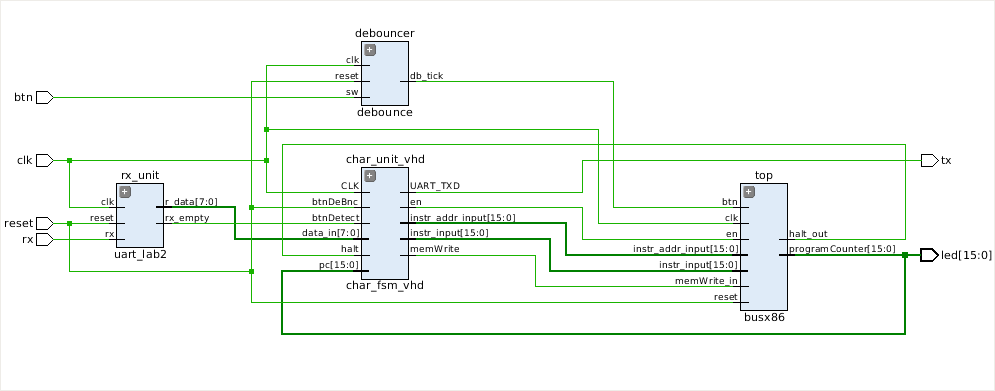
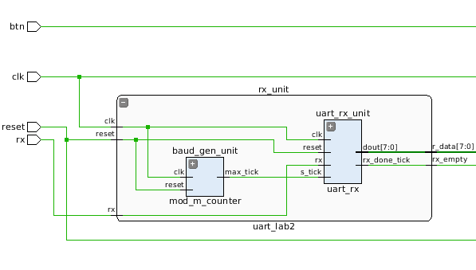
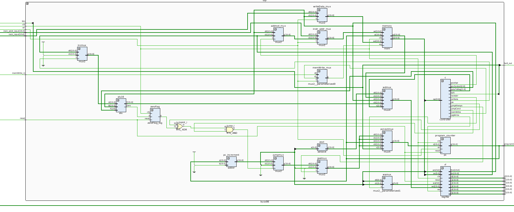

#Top-level Schematic:

#UART Rx Module Schematic

#BUSx86 Schematic

The updated processor schematic shows the addition of a processor enable signal that is controlled by the character generator FSM. This enable signal will turn off the write enable port of the program counter when the processor is disabled, thereby not allowing the processor to execute instructions. The enable signal is also tied to three new multiplexors which interface with memory. These multiplexors choose between data originating from the processor (processor is enabled) or data originating from the uart module (processor is disabled and is accepting instructions from the user).

The FSM controlling the character generation (i.e., sending characters via UART) is so large that VHDL had to be used to keep track of state names in simulation. A great feature of VHDL is the ability to enumerate state names and have those enumerations carry over to simulation in human-readable form.
