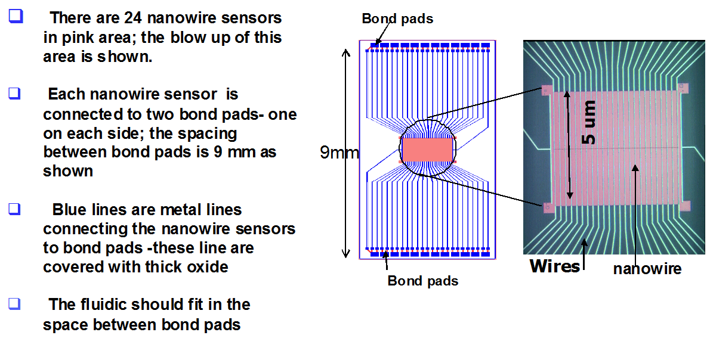

# Phone call with Sufi:

+ Silicon Nanowire notes
	+ Need at least 10u liters of fluid, but she uses 40
	+ Need a reference electrode 1mm in diameter
	+ Bond pads are 9mm apart
	+ First step is to acquire a dummy device while processing the mounds of
  	paperwork required to actually obtain a device
	+ She uses an Agilent B1500 to characterize (IV curve) the device. Applies a
  	voltage sweep while simultaneously measuring current

+ Bioelectronics project notes
	+ Work will go in the Fluigi section until we dream up an awesome name
	+ **Action Item**: Dream up an awesome name
	+ The sensor could pass a signal to the ufluidics controller
	+ WIRELESSLY TRANSMITTING BACTERIA!!
	+ **Action Item** Check out Jeff Hasty's oscillator
	+ Written Notes:


# Silicon Nanowire Paper Notes:
+ Q: What does this technology look like:
+ A: This


+ Q: What makes this technology novel?
	+ ISFETs (Ion-Sensitive FETs are not a new concept)
+ A: 
	- ISFETs and silicon nanowire FETs are not the same
	- > No other "studies has investigated the effect of ionic concentration
	  of the solution on pH measurement sensitivity."
	- > "The pH sensitivity is shown to be independent of the buffer
	  concentration."

		- What's the difference between ```ionic concentration of the
		  solution``` and ```the buffer concentration```?

	- So the novel idea appears to be using a ```bilayer SiO2/HfO2```
	  dielectric stack
		> where the HfO2 layer is the sensing surface in concact with
		> the buffer solution and the SiO2 forms the interfacial layer
		> at the silicon channel. Using HfO2 as the sensing surface has
		> an important advantage over SiO2: pH sensitivity is higher
		> and is independent of the buffer concentration.
	- HfO2 is also the important, and seemingly novel concept, because it
	  > not only has excellent ph sensing properties but is also
	  > chemically inert in most acidic and basic solutions with the exception of
	  > hydrofluoric acid based solutions

# Lunch With Cassie
- Problem: Why are we trying to use biology to do computation? Why even have
  logic in bacteria?
- Answer (?): Perhaps we can use an array of biological sensors that can
  compute one output, which can then be read by a electrochemical transducer. I
think the biggest, literally in terms of size, problem with the current
biological sensor design is the size of the electrochemical transducer. Having
only one electrochemical transducer seems, to me, like a big win.
