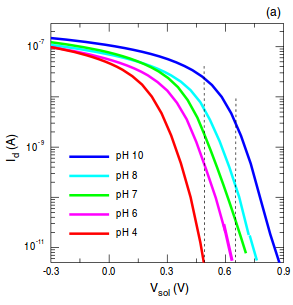

#### [pH-based biosensor for detection of arsenic in drinking water](/papers/pH_based_biosensor_arsenic_drinkingwater.pdf)

#### [Development of a novel biosensor for the detection of arsenic in drinking water](/papers/Edinburgh_Development_arsenic_drinking_water.pdf)
- World Health Organization recommended limit is 10 ppb or [10 $\mu$g/litre](http://www.who.int/mediacentre/factsheets/fs372/en/)
- Sensor can detect 5 ppb, albeit with a caveat
 - You must wait 500 minutes before the Output Dynamic Range between 0ppb and 5ppb goes above .1pH
##### pH vs Time:

#### [Optimization of pH sensing using silicon nanowire field effect transistors with HfO2 as the sensing surface](/papers/NanowireFET_Nanotechnology.pdf)

#### [Realizing the potential of synthetic biology](/papers/nrm3767.pdf)

#### [Engineering E Coli to see light](/papers/Engineering_EColi_tosee_light.pdf)

#### [Spatiotemporal control of cell signalling using a light-switchable protein interaction](/papers/Spatiotemporal.pdf)

#### [A Synthetic Genetic Edge Detection Program](/papers/Synthetic_edge_Detection.pdf)

#### [Combining microfluidics and synthetic biology](/papers/Microfluidics_and_SynBio.pdf)

#### [Sensors for Micro Bio Robots via Synthetic Biology](/papers/uBioRobots.pdf)

#### [Microfluidic Large-Scale Integration](/papers/thorsen2002.pdf)
- Review paper for the state of the microfluidic art in 2002
> A key component of these networks is the fluidic multiplexor, which is a combinatorial array of binary valve patterns that exponentially increases the processing power of a network by allowing complex fluid manipulations with a minimal number of inputs.

> On the basis of the utility of these examples, we believe that other concepts developed for electronic integrated circuits can be usefully transferred to chemical and biochemical analysis and processing in microfluidic devices

#### [A Synthetic Multifunctional Mammalian pH Sensor and CO2 Transgene-Control  Device](/papers/Mammalian_pHSensor.pdf)
- Device pitched as a treatment for diabetes
> Life operates...within a narrow biochemically permissive range (e.g., pH
> 7.35-7.45 in humans

#### [Abstraction Layers for Scalable Microfluidic Biocomputers](/papers/Abstraction_Layers.pdf)

#### [Tuning Response Curves for Synthetic Biology](/papers/Tuning.pdf)
> Synthetic biology includes a concerted effort to formalize an engineering discipline suitable for the design and implementation of novel biological systems.

- Biology operates in a noisy environment
- Response curve defined by a single first order differential equation, which is a highly approximate model based on "empirical observations" 

#####Hill Function

$$\theta(x)=\frac{x^n}{K^n+x^n}$$

- $x$ = unbound ligand concentration
- $\theta(x)$ = avg fraction of binding sites occupied by an input ligand as a function of unbound ligand concentration.
- $K$ = The Hill constant. Rough indicator of the level of ligand concentrations needed to induce saturation ($x \gg K$)
- $n$ = The Hill coefficient. **The larger the value of $n$, the steeper the slope of the Hill function**
 - $n > 1$ indicates cooperativity, where affinity increases in the presence of previously bound ligands
 - $0 < n < 1$ indicates negative cooperativity, where affinity is reduced
 - $n = 1$ indicates a noncooperative reaction

#####Equation for Protein Expression

$$\frac{dy}{dt}=k' + k \left(\frac{x^n}{K^n+x^n} \right)$$

- $y$ is the concentration of the protein being expressed
- $k'$ is the basal rate of production
- $k$ is the maximum additional production rate arising from up-regulation
- $\left(\frac{x^n}{K^n+x^n} \right)$ is the increasing sigmodal Hill function

Equation for Protein Repression

$$\frac{dy}{dt}=k'+k\left(\frac{K^n}{K^n+x^n}\right)$$

- $k'+k$ is the basal expression rate
 - $k'$ accounts for the fact that complete repression may not be possible
- $\left(\frac{K^n}{K^n+x^n}\right)$ is the decreasing sigmodal Hill function

#####Types of Tuning

- **Vertical Scaling** 
 - Change the promoter-gene copy number
   - Multiplies the rate at which mRNA is produced and therefore translated
 - Change RBS strength
 - Codon optimization
- **Vertical Shifting**
 - Introduce or tune a constitutive (always on) source of output $y$
- **Vertical Extension**
 - Up-Regulation: Tune the activation potency of bound TF protein 
 - Down-Regulation: No known single-step method (excluding $k'=0$ case, which is identical to vertical scaling)
- **Leakage**
 - Up-Regulating: Leakage is that which is always active
   - No known direct method
 - Down-Regulating: Leakage is that which cannot be repressed
   - Vary the repression strength of each bound TF protein 
- **Horizontal Scaling**
 - Tune the Hill constant $K$ (increasing $K$ scales curve to the right)
   - $K$ is related to the effective binding affinity of the input signal to the process
 - Tune the binding affinity of the TF to the promoter
- **Steepness**
 - Tune the Hill coefficient $n$ (increasing $n$ leads to increasing steepness)
 - _Ultrasensitivity:_ A biochemical process that has a steep or switch-like steady-state response curve
 - Requires adjusting the effective binding cooperativity
   - Implies the cooperative binding of multiple TFs to the same promoter
- **Dynamic Range**
 - The observable space between uninduced and fully saturated induction

### [CAD for Microfluidic Chips Based on Multilayer Soft Lithography](/papers/soft_litho_CAD.pdf)
> A second difference between electronic CAD and microfulidic CAD is the fast turn-around time in manufacturing microfluidic chips.

I argue that prototyping using FPGAs is significantly faster than manufacturing microfluidic chips.
