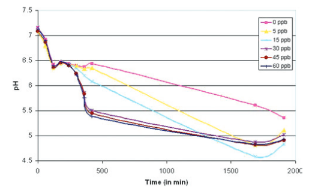
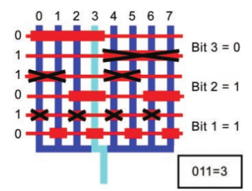
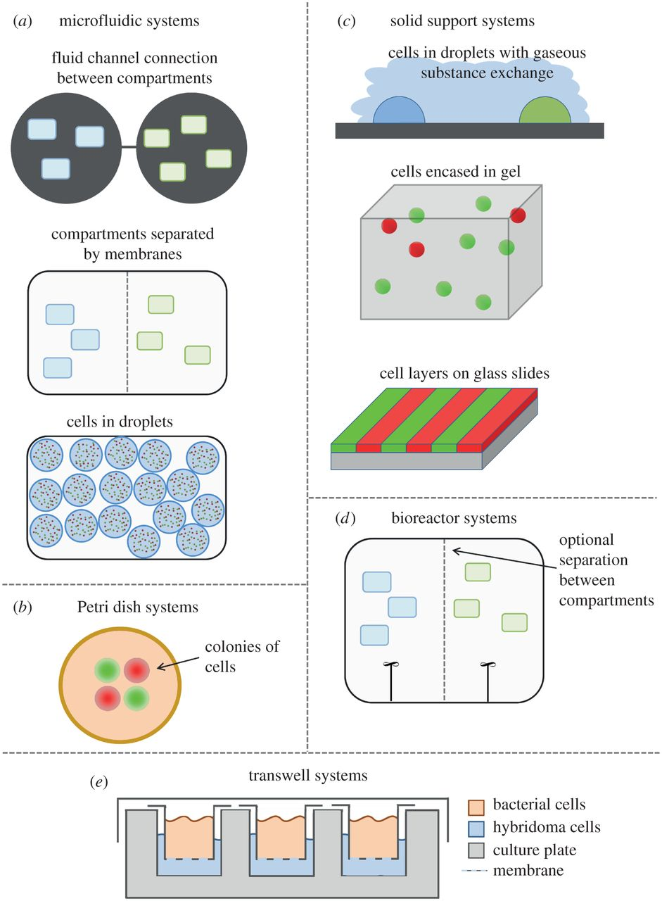

#Biosensors

- [Biosensor for Direct Determination of Organophosphate Nerve Agents using Recombinant E.Coli](http://pubs.acs.org/doi/full/10.1021/ac9805201)

- [Synthetic Biology and the Art of BioSensor Design](/papers/ApplicationsSynBio.pdf)

- [pH-based biosensor for detection of arsenic in drinking water](/papers/pH_based_biosensor_arsenic_drinkingwater.pdf)

- [Development of a nir fovel biosensor for the detection of arsenic in drinking water](/papers/Edinburgh_Development_arsenic_drinking_water.pdf)
  - World Health Organization recommended limit is 10 ppb or [10 $\mu$g/litre](http://www.who.int/mediacentre/factsheets/fs372/en/)
  - Sensor can detect 5 ppb, albeit with a caveat
    - You must wait 500 minutes before the Output Dynamic Range between 0ppb and 5ppb goes above .1pH
  -  pH vs Time:

- [Optimization of pH sensing using silicon nanowire field effect transistors with HfO2 as the sensing surface](/papers/NanowireFET_Nanotechnology.pdf)

- [Engineering E Coli to see light](/papers/Engineering_EColi_tosee_light.pdf)

- [A Synthetic Genetic Edge Detection Program](/papers/Synthetic_edge_Detection.pdf)

- [Spatiotemporal control of cell signalling using a light-switchable protein interaction](/papers/Spatiotemporal.pdf)

- [Realizing the potential of synthetic biology](/papers/nrm3767.pdf)

- [Environmental Sensing of Heavy Metals Through Whole Cell Microbial Biosensors: A Synthetic Biology Approach](/papers/berezamalcolm2014.pdf)
  - Refs 13 (aleksic2007), 47 (demora2011), 50 (stocker2003) and 55 (joe2012) all make sensors that modulate pH

- [Sensors for Micro Bio Robots via Synthetic Biology](/papers/uBioRobots.pdf)

- [A Synthetic Multifunctional Mammalian pH Sensor and CO2 Transgene-Control  Device](/papers/Mammalian_pHSensor.pdf)
  - Device pitched as a treatment for diabetes
> Life operates...within a narrow biochemically permissive range (e.g., pH
> 7.35-7.45 in humans

- [Tuning Response Curves for Synthetic Biology](/papers/Tuning.pdf)
> Synthetic biology includes a concerted effort to formalize an engineering discipline suitable for the design and implementation of novel biological systems.

  - Biology operates in a noisy environment
  - Response curve defined by a single first order differential equation, which is a highly approximate model based on "empirical observations" 

  - Hill Function

$$\theta(x)=\frac{x^n}{K^n+x^n}$$

  - $x$ = unbound ligand concentration
  - $\theta(x)$ = avg fraction of binding sites occupied by an input ligand as a function of unbound ligand concentration.
  - $K$ = The Hill constant. Rough indicator of the level of ligand concentrations needed to induce saturation ($x \gg K$)
  - $n$ = The Hill coefficient. **The larger the value of $n$, the steeper the slope of the Hill function**
    - $n > 1$ indicates cooperativity, where affinity increases in the presence of previously bound ligands
    - $0 < n < 1$ indicates negative cooperativity, where affinity is reduced
    - $n = 1$ indicates a noncooperative reaction

  - Equation for Protein Expression

$$\frac{dy}{dt}=k' + k \left(\frac{x^n}{K^n+x^n} \right)$$

    - $y$ is the concentration of the protein being expressed
    - $k'$ is the basal rate of production
    - $k$ is the maximum additional production rate arising from up-regulation
    - $\left(\frac{x^n}{K^n+x^n} \right)$ is the increasing sigmodal Hill function

  - Equation for Protein Repression

$$\frac{dy}{dt}=k'+k\left(\frac{K^n}{K^n+x^n}\right)$$

    - $k'+k$ is the basal expression rate
      - $k'$ accounts for the fact that complete repression may not be possible
    - $\left(\frac{K^n}{K^n+x^n}\right)$ is the decreasing sigmodal Hill function

  - Types of Tuning

  - **Vertical Scaling** 
    - Change the promoter-gene copy number
      - Multiplies the rate at which mRNA is produced and therefore translated
    - Change RBS strength
      - Codon optimization
  - **Vertical Shifting**
    - Introduce or tune a constitutive (always on) source of output $y$
  - **Vertical Extension**
    - Up-Regulation: Tune the activation potency of bound TF protein 
    - Down-Regulation: No known single-step method (excluding $k'=0$ case, which is identical to vertical scaling)
  - **Leakage**
    - Up-Regulating: Leakage is that which is always active
    - No known direct method
    - Down-Regulating: Leakage is that which cannot be repressed
    - Vary the repression strength of each bound TF protein 
  - **Horizontal Scaling**
    - Tune the Hill constant $K$ (increasing $K$ scales curve to the right)
    - $K$ is related to the effective binding affinity of the input signal to the process
    - Tune the binding affinity of the TF to the promoter
  - **Steepness**
    - Tune the Hill coefficient $n$ (increasing $n$ leads to increasing steepness)
    - _Ultrasensitivity:_ A biochemical process that has a steep or switch-like steady-state response curve
    - Requires adjusting the effective binding cooperativity
    - Implies the cooperative binding of multiple TFs to the same promoter
  - **Dynamic Range**
    - The observable space between uninduced and fully saturated induction

#Microfluidic Valve Control
- [Build your own microfluidic valve controller](https://sites.google.com/site/rafaelsmicrofluidicspage/valve-controllers)
- [Use syringes to test a microfluidic chip](http://web.stanford.edu/group/foundry/Testing%20Using%20Syringes.html)

#Fluigi

- [Fluigi: Microfluidic Device Synthesis for Synthetic Biology](/papers/huang2014.pdf)
  - 

- [Integration of microfluidics into the synthetic biology design flow](/papers/huang2014_flow.pdf)

#Microfluidics

- [Theory and Analysis of Generalized Mixing and Dilution of Biochemical Fluids Using Digital Microfluidic Biochips](/papers/roy2014.pdf)

- [Combining microfluidics and synthetic biology](/papers/Microfluidics_and_SynBio.pdf)

- [Microfluidic Large-Scale Integration](/papers/thorsen2002.pdf)
  - Review paper for the state of the microfluidic art in 2002
> A key component of these networks is the fluidic multiplexor, which is a combinatorial array of binary valve patterns that exponentially increases the processing power of a network by allowing complex fluid manipulations with a minimal number of inputs.

> On the basis of the utility of these examples, we believe that other concepts developed for electronic integrated circuits can be usefully transferred to chemical and biochemical analysis and processing in microfluidic devices

- [Abstraction Layers for Scalable Microfluidic Biocomputers](/papers/Abstraction_Layers.pdf)

- [CAD for Microfluidic Chips Based on Multilayer Soft Lithography](/papers/soft_litho_CAD.pdf)
> A second difference between electronic CAD and microfulidic CAD is the fast turn-around time in manufacturing microfluidic chips.

  - I argue that prototyping using FPGAs is significantly faster than manufacturing microfluidic chips.

- [Recent developments in microfluidic large scale integration](/papers/Recent_uF_Developments.pdf)

  - A programmable uF platform has kind-of been investigated, albeit just for mixing and processing via fluorescent derivatization.

- [Digitally programmable microfluidic automaton for multiscale combinatorial mixing and sample processing](/papers/Programmable_uF_automaton.pdf)
  - The review paper quotes the shortcomings of the device as: 
> larger hybrid PDMS/glass valve technology differentiates itself from mLSI and is more suitable for microliter scale fluid volue processing (the chamber volume is 120 nL); moreover this technology requires one external valve per chamber and it seems unlikely that any reduction is possible
  - On second glance, an FPGA-like uF platform has been done...damn:

- [A software-programmable microfluidic device for automated biology](/papers/FPGA_uF.pdf)
  - And again...This time using a combination of flow based and electrowetting-enabled droplet based uF

- [A programmable droplet-based microfluidic device applied to a multiparameter analysis of single microbes and microbial communities](/papers/Programmable_electrowetting_uF.pdf)
>This is largely due to the prevailing para-digm in microfluidic research in which devices are“hardwired” for specific fluid handling tasks, necessitating a customized design for each application or change in protocol. This application-spe-cific approach requires iterative cycles of device design, fabrica-tion, and testing, presenting a major obstacle to the development of new applications and limiting user adoption and community access. In analogy to how programmable integrated circuits en-abled a broader community of developers and nonexpert users,the advancement of programmable microfluidic devices standsto dramatically enhance the pervasiveness and impact of micro-fluidic systems (15)
  - **Idea**: what if you combine MHDL with an actual chip by building a Place-and-Router?
    - or what if you built a programmable mLSI chip that could be addressed by MHDL, or a subset thereof?
  - **This doesn't seem to have been investigated!**
    - The electrowetting device uses a LABVIEW program to control the chip

- [Methods used to make device](Methods_ProgramElectrouF.pdf)
  - The claimed FPGA-like devices uses Visual Basic to address the solenoid elements
  - The evolution of the FPGA began with the HDL, not the other way around...right?

- [Automatic Synthesis of Microfluidic Large Scale Integration Chips from a Domain-Specific Language](/papers/MHDL_Synth.pdf)
  - MHDL is a specification language for mLSI chip architectures, as opposed to assay specification. An assay specification language compatible with MHDL is
Biocoder as shown in this paper: - Introduced here: 

- [Design and Verification Tools for Continuous Fluid Flow-based Microfluidic Devices](/papers/MHDL.pdf)

#Characterization
- [Optogenetic characterization methods overcome key challenges in synthetic and systems biology](/papers/Tabor_OptoChar.pdf)
>Component signal processing properties, such as the relative amplitude (gain) and time delay of output relative to input for various signals, are captured using **phenomenological**, or 'black box' mathematical models. The models are used to reliably assemble components into circuits with more advanced capabilities, such as band-pass filters or amplifiers, and eventually into complete systems, such as computers or radios

  - i.e. Derive models from experimentation, NOT FROM BIOLOGICAL THEORY!

>Given sufficient measurements, one should be able to formulate a mathematical model that accurately predicts receptor outputs for input signals that have not been tested. Because the only purpose of the model is to predict receptor I/O, a black-box model will typically be preferred over a more complicated version reflecting the receptor molecular biology. Once it is parameterized with experimental data, the model can be used to simulate the receptor response to a wide range of different inputs in silico, thus enabling the computational design of effector signals capable of driving biological signals with desired quantitative and temporal features and satisfying challenge two. Additionally, if receptor outputs can be measured using fluorescent proteins in real time, an in silico feedback controller can adjust the designed input signal to account for any deviations from the model prediction

- [Evolution Paper](/papers/Evolution.pdf)

- [Analog Synthetic Biology](/papers/Analog_Synbio.pdf)

> Nevertheless, we must not forget that digital computation has not offered an effective paradigm for computing efficiently and precisely with noisy and unreliable devices; that multi-logic-gate computations can impose significant metabolic or toxicity burdens on cells owing to their need to use a lot of parts and power; that the fact that there are five to six orders of magnitude fewer genes per cell than digital transistors per chip means that using genes to only perform logic is likely not an efficient way to attain high complexity; that a library of ‘digital parts’ with good on–off ratios, low standby power consumption and low crosstalk does not exist in biology; that the computing basis functions in cells are not really logic functions and abstracting them as such compromises computational efficiency; and that logic basis functions are not the only universal computation primitives.

  - No static discipline? Don't just make one up that doesn't work the same way in cells as it does in computers!

> The ‘1’s and ‘0’s of today’s digital computers are useful abstractions of the analog signals in cells, but are often an oversimplification.

  - If digital abstraction can't be used to create a working system, then it isn't digital abstraction!

> Furthermore, as in analog circuits, the wiring of the output of one circuit to the input of another leads to ‘loading’ interactions that degrade overall function and prevents simple modular digital abstractions from being effective [13].

  - Figure 1b allows you to focus on a "protein input protein output" point of view

- [Voigt Nor Gate](/papers/voigtNORGate.pdf)

# Cell to Cell communication applications
- [ Spatial Structure Facilitates Cooperation in a Social Dilemma: Empirical Evidence from a Bacterial Community](/papers/felix2013.pdf)
  - GASP = Growth Advantage in Stationary Phase
> The fact that cooperation is simultaneously ubiquitous and fragile, begs for an explanation regarding its emergence and maintenance.
> E. coli bacteria collectively restrain growth to avoid population collapse when resources become scarce [21]–[23]. The collective decision to restrain growth before all resources are depleted is a form of altruistic cooperation, and one can think of the entry into stationary phase as a social contract: a collective rule of density-dependent growth regulation [9], [24]. The long-term benefits of going into stationary phase are evident: by limiting population growth, bacteria ensure that enough resources will be available to maintain a viable population for an extended period, and survive until conditions improve and growth can be resumed. In the short term however, ‘cheater’ cells that ignore the collective decision to restrain growth and that utilize the scarce resources to proliferate instead of investing in maintenance, may increase in numbers. As a result, cheaters jeopardize the survival of the collective – which in turn could face a tragedy of the commons [25].
In a Prisoner's Dilemma, the Sucker's payout is negative for their model (only look at the sign of the payoff differences) to work; in a Snowdrift regime the Sucker's payout is positive). 

- [Cooperation and bacterial pathogenicity: an approach to social evolution](/papers/Molina2014.pdf)

- [Co-culture systems and technologies: taking synthetic biology to the next level](/papers/Goers2014.pdf)
  - Review paper on experimental and theoretical co-culture set-ups in nature and synbio
  - Co-culture setups exist to study cell-cell interactions of any kind
  - Current co-culture systems (methods of separating cell populations

  - **Does TweeColi offer a novel method of conducting co-culture experiments?**
> As population interactions suffer from context dependency and can change in different environments, characterization should include stress limits. For example, an engineered interaction was reported to be functional only within certain pH ranges [39]. Taking context dependency into account does not imply a departure from the engineering and computing analogy on which synthetic biology is based, but rather an improved appreciation of the challenges that come with the analogy. Just as civil engineers need to consider the environmental stresses that a building will have to withstand, synthetic biologists need to consider the working environment of bio-parts at the stage of circuit design. On the other hand, co-culture technologies can support the genetic engineering that is at the basis of synthetic systems. Genetic programming cannot entirely predict cellular behaviour, as environment plays a role and there are still limits in what can be controlled genetically [41]. Using genetic engineering and controlled environmental conditions through experimental set-up together could allow a level of population control that was previously thought impossible. Emergent and unpredicted behaviour can arise in co-cultures and may or may not be desired. One important question in the choice of cultivation technology is what properties of the natural populations are to be preserved or suppressed. Overall, populations can be controlled genetically and through the environment. Which aspects can be controlled genetically or through set-up is a subject of ongoing research.
- [Engineering of synthetic intercellular communication systems](/papers/Bacchus2012.pdf)
  - Review paper of intercellular communication and multicellular consortia
  - Can we do the population control experiment in A below using TweeColi?

- [Cultivating the uncultured: limits, advances and future challenges](http://link.springer.com/article/10.1007/s00792-009-0261-3/fulltext.html#CR84)  **No pdf link**
  - Culture isolation using pH control?

# Synthetic Biology Design
- [From *bricolage* to BioBricks: Synthetic Biology and rational design](/papers/Lewens2013.pdf)
  - Explores the limitations of the synbio design process 
  - Synthetic Biology defined by the European Commission as "the synthesis of complex, biologically based (or inspired) systems which display functions that do not exist in nature. This engineering perspective may be applied at all levels of the hierarchy of biological structures...In essence, synthetic biology will enable the design of 'biological systems' in a rational and systematic way' 
> The UK Health and Safety executive says that synthetic biology can be described as ‘the design and construction of new biological parts, devices and systems, and the redesign of existing, natural biological systems for useful purposes’ (HSE, 2007). The European Commission says that synthetic biology is ‘the engineering of biology: the synthesis of complex, biologically based (or inspired) systems which display functions that do not exist in nature. This engineering perspective may be applied at all levels of the hierarchy of biological structures … In essence, synthetic biology will enable the design of “biological systems” in a rational and systematic way’ (European Commission, 2005). The UK Parliamentary Office of Science and Technology tells us that synthetic biology ‘describes research that combines biology with the principles of engineering to design and build standardised, interchangeable biological DNA building-blocks. These have specific functions and can be joined to create engineered biological parts, systems and, potentially, organisms. [Synthetic biology] may also involve modifying naturally occurring genomes … to make new systems or by using them in new contexts’ (POST, 2008).
  - 'Bottom up' design = construction of genetically specified components and combine them to create novel organic devices
  - Top down = begin with naturally occurring organisms and seek to remove redundant or unnecessary parts to produce simpler, less 'noisy' organic machines.
  - Research Opportunity?
> the notion that an engineering design perspective characterises a variety of synthetic biology approaches remains in very recent research articles
  - Irrational vs Rational design process
> It is nonetheless reasonable to place synthetic biology towards one end of a continuum between purely ‘blind’ processes of organic modification at one extreme, and wholly rational, design-led processes at the other. 
     - Irrational:
> They are ‘irrational’ only because the agent who oversees the process need not understand why the resultant entity works as it does. Whether a method is ‘rational’ or ‘irrational’ is itself something that comes by degrees: an engineer may not understand why the parts of a machine work as they do, but he may still be able to predict in rough-and-ready ways how they will behave when brought together. After several moderately successful attempts he may be surprised at the makeup of the machine that works best.
  - Nazi attempt to breed back aurochs failed because
> On the basis of vague criteria and without proper knowledge of the appearance of the aurochs, the two brothers made inaccurate selections among the crossbreeding products of various cattle breeds. They did not use the knowledge about the aurochs that was available at the time, nor did they take advantage of the breeding techniques others were using to create new cattle breeds in the same period. (Van Vuure, 2005, p. 366)
**Poor engineering design methodology**
  - With regard to directed evolution, 'the creativity of synthetic biology itself continues to rely on processes whose efficacy may be inscrutable to the designers themselves, and which have much in common with familiar breeding techniques'
  - Irrational design in 'evolutionary electronics'
    - An FPGA was altered slightly and continuously tested for an ability to do a task and the best design could never have been achieved using normal design techniques
> [These cells] cannot be clamped [i.e. returned to their default ‘blank’ state] without degrading performance, even though there is no connected path by which they could influence the output … They must be influencing the rest of the circuit by some means other than the normal cell-to-cell wires: this probably takes the form of a very localised interaction with immediately neighbouring components. Possible mechanisms include interaction through the power-supply wiring, or electromagnetic coupling. ( Thompson, 2002)
  - Reducible complexity is not an artifact of evolution (T. Lewens 2004), therefore we should not expect to isolate components and then stick them together in a different order and expect rational behavior
> Evolution has been free to explore the full repertoire of behaviours available from the silicon resources provided, even being able to exploit the subtle interactions between adjacent components that are not directly connected. (Thompson, 2002)
  - **Does natural selection prefer modularity? Will it pick a modular design vs a non-modular design?**
> It remains unclear whether natural selection is able to favour modularity
> Natural selection is not constrained by a prior methodological commitment to rationality, and since natural selection must build traits that are effective in the face of regular internal and external insults, natural selection also needs to ensure that its products are robust against a range of environmental perturbations
  - Abandon the idea of modularity in synthetic biology?
> Biological complexity is here acknowledged, the barriers it presents to human intervention are explicitly admitted, and attempts are made to avoid it (in the first instance, at least) via the creation of simpler systems.
 - Citing M. O'Malley 'Exploration, iterativity and kludging in synthetic biology': 
>  Rather than focusing on hypotheses, testing and inference, synthetic biology invites attention to the practices of exploration, iterativity and kludging. Examining such strategies in relation to synthetic biology offers new avenues of insight for philosophy of science and biology.
 - **Why not design with system complexity in mind? For SynBio, this comes at the cost of modularity**

- [Synthetic Biology at the Limits of Science](/papers/Nordmann2014.pdf)
  - How should we approach understanding biology for achieving 'technical control'?
    - Understanding
    - Rationality
    - Design
  - Understanding
    - Ability to create is touted by some as necessary to demonstrate understanding 
      - Hypothesize, model, verify through experimentation 
      - Creating is a method of knowledge exploration?? The author seems dubious
> If one wants to engineer a biological structure or process, one "cannot help" but gain understanding also (Benner/Sismour 2005)
    - Richard Feynman: "What I cannot create, I do not understand" != "What I can create, I do understand"
> The ability to create now appears as a sufficient condition for understanding, suggesting that "understanding" can leap ahead of explanation and prediction
    - Understanding involves removing complexity for the sake of deriving cause
  - Rationality (Engineering principles)
    - Why is design by trial-and-error (irrational design) seen as "less civilized" than rational design?
> Those still working in the mode of trial and error have not ascended as yet to a level of intellectual and technical control that would allow them to invent new processes or devices simply from considerations of theory and principle

      - counter example: "rational drug design" proved inferior to high-throughput, trial and error methods (Adam 2010) so the scientific community responds with nanomedicine and visions of targeted drug delivery ("this time we'll get it right")
    - Amazing questions:
> Similarly, the aspirations of synthetic biology are oft en judged in these terms Can the 'synthesis' of biological structures or processes proceed in a planned, deliberate, theory - and evidence - based manner such that the intended outcome is sues as if from a blueprint (Giese et al. 2013, O’Malley 2009 , Gramelsberger 2013 , Lewens 2013 ) ? And , if this is not the case , is this only “not yet ” the case, likely to become possible in just a few more years , or does it owe to a disc iplinary style of doing things – with chemists seeking rational control while bioengineers are more comfortable with tinkering ? Or does the failure of rational design owe to a limit of biological complexity that is irreducible and thus an insurmountable limit of control?

    - Author's assertion: "The hierarchical conception that places rational engineering above tinkering is blind to the possibility of rational tinkering"
    - Engineering may be opposed to "blind groping" but not search strategies that exploit random variations or iterative adaption and tuning.
> These, to be sure, are rational strategies by which to work around limits of knowledge, and to achieve technical solutions in the absence of information about mechanical detail. **In other words, these are rational strategies to create robust black boxes or modules**
    - Author's engineering design process
      1. Analyze the situation to be emulated, automated or modeled
      2. Based on analysis, construct a skeletal technical system (prototype)
      3. Test the prototype
    - The process applies "rational engineering principles" only up to the construction of the initial prototype
      - The process is no longer an analysis of the initial situation, but the current technical system
      - Each iteration inserts complexity until, "in the limit, the designed system emulates the target system near-perfectly and does so because it is similarly complex"
> Thus one finds that a predictively successful simulation model can be nearly as complex and just as intractable as the “natural” system that is modeled by it(see, e.g., Lenhard/Winsberg 2010).This is a technical achievement by rational means. Though it does not consist in the application of “rational engineering principles,”it is not “mere” tinkering either,but a strategy to systematically optimize the performance of a technical system. 
    - Systems Biology vs Synthetic Biology
> Systems biology seeks total information and thus incorporates into its representational models all the findings of omics-research, synthetic biology wants to find out how far we can get with what little we know
  - Design vs Evolution...uh oh!
> While anti-Darwinian theories of intelligent design are in ill-repute, how can synthetic biology speak of design processes and simultaneously take the insights of evolutionary biology into account?...conceiving the same biological entity at one time as an object of design (as far as that will go), and at another time as an object of evolution (to the extent necessary), synthetic biologists are tending to the boundary between organism and artifact even as they appear to undermine or even reject it.
    - What is the aim of SynBio?  
      - Mimic biology? If so, then "artificial selection" is present instead of "natural selection". i.e. the divices have a purpose, which is not allowed in natural selection and not supported by evolutionary history
      - Reproduce the work of natural evolution in a purposeful manner? Author asserts that this notion seems troubled by "techonolgical hubris" and accusations of "playing God", but it can be a sound notion if you treat "nature" as the engineer subject to its own laws. 
> "If there are laws of nature, we can't violate them anyhow, and in the meantime, it is our job to push the limits of tehcnical possibility"
> The very question s of how biological engineering should be related to natural history, or of how ev oluti on by natural selection differs from the design of b iological artifacts thus depend on our conception of synthetic biology – is it an intellectual enterprise with at least some theoretical ambitions or should one judge its attempt to advance unde rstanding of biological systems only in engineering terms ? Only in the former case does the problem arise of having to reconcile the competing ideas of evolution and design , while in the latter case it is merely a practical challenge to insulate as far as possible t he construction of biological entities and processes from the vagaries of evolutionary influence. This fault line between synthetic biolog y as somewhat theory - oriente d and as exclusively engineering - oriented also separates the two ways of paraphras ing Fey nman’s dictum as well as the two conceptions of rational engineering. It is the fault line that runs between science and technoscience.
    - I take issue with the statement that if synbio is viewed "only in engineering terms" then one does not have to "reconcile the competing ideas of evolution and design". What if part of the engineering process requires knowing how the original system came to be in order to further modify it, as in complex system design? 
      - I think it's a copout to assume that engineers can assume away issues that may be relevent to design because they don't have "theoretical ambitions"
      - What happens when design (synbio) meets evolution (wild-type organisms). The author asserts this consideration should enter at the beginning of design "in reflections on the rhyme and reason of naturally evolved biological complexity". Doesn't "rhyme and reason" imply a purpose
  - Why study the origin of synbio's?
    -  Normative implications of historical accounts, "suggesting what synthetic biology ought to be and what opportunities and risks it poses, what obligations and expectations come with it"
    - Is synbio an intellectual paradigm-shift from systems biology that revolves around systems-thinking to understand complexity (synbio is applied systems bio) or is it a means of generating higher complexity by treating systems as more or less efficient units of technical functioning?
  - Synbio is the application of systems bio
    - Normative behavior = synbio  must properly apply systems bio
    - "Systems" are dynamic structures that require general systems theory or a theory of non-linear complex dynamics to describe it
    - _Irreducible Holism_ triumphs over _Reductionist Mechanism_
  - Synbio is a Technical Opportunity
    - "Systems" are a technical construct that consists of at least sever interacting parts
      - NOT a holistic way of thinking
    - Normative behavior = what amount of complexity can I generate with the least amount of theoretical understanding?
      - iGEM illustrates this example (even undergraduates can "do" synthetic biology!!)
      - _Reductionist Mechanism_ does not necessarily triumph over _Irreducible Holism_, the questions are neither answered nor dismissed. Rather, they are absorbed into an "engineering idiom"
  - **SUMMATION OF SYSTEMS THINKING VS TECH OPPORTUNITY (scientific vs technoscientific)**
> To put it a bit metaphorically, then, in relation to systems biology , the two stories about synthetic biology do not attribute to the researchers different theories, opinions , or beliefs but an entirely different mind - set , a different way of living the laboratory life, of participating in history and relating to the tradition of science and the Enlightenment. On the one hand, t here is the scientific mind - set of those who query the limits of reductionism and embrace systems thinking ; on the other hand is the technoscientific mind - set of those who no longer seek the most appropriate way of reducing complexity and promoting intellectual understanding , but who proceed instead to generate biological complexity from available theories and techniques.
  - Conflict
    - Researchers may work using both methods, but within publications they only demonstrate one way of thinking
    - If Synbio tries to have it all (basic and applied science) then there are three conflicts that emerge 
      1. Accommodating ignorance
      2. Discontinuous continuities
      3. The matter of definition
    - Accommodating ignorance
      - What happens when senior researchers confront iGEM teams that "impatiently seek to achieve on extremely short time scales what others frame in terms of multidisciplinary, sometimes career-long research trajectories"?
      - Five hard truths for synbio - Roberta Kwok
        - Problem: No standardization 
	  - Answer: sub relative for absolute measures
        - Problem: No predictable design proceedures and trial and error is too arduous
          - Answer: Directed evolution, i.e. the design cycle and its  iteration "until the system is optimized"
	- Problem: Greater system complexity
	  - Answer: Automation
	- Problem: Unexpected interactions
	  - Answer: Insulate biological machinery from cell's "natural machinery"
	- Problem: Variability and stability
	  - Answer: Avoid variability and increase stability
	- **Summary**: Only chance for synbio to succeed is by way of design processes that can acoommodate or work around ignorance
      - Nature published an editorial on the 10th anniversary of the repressilator and a switchable regulartory network and say that these "contributions to and from basic science are part of synthetic biology that most deserves celebration"
        - Does this mean synbio is a basic science? an applied science? if applied science then:
	  - "in which sense...is the design of the repressilator an 'experiment'"?
	  - Is "to understand something one must build it" really a principle of physics as a basic science?
	  - How and when is "to design" the same thing as "to define"?
	  - How is the ability to create a computer model the same as human knowledge, ex. theories that are tractable by the human mind
	    - Remember that the quote is "What I cannot create, I do not understand" not "What I can create, I do understand", which implies that "understanding" can leap ahead of explanation and prediction
      - Discontinuous continuities

        - From Bujara and Panke, 2010); Issues;
	  - The rest of the paper was highlighting discontinuous differences between design by Random Evolution, Directed Evolution and Comginatorial Design
	  - Design by Random Evolution (evolutionary design) is an oxymoronic misnomer...see intelligent design
	  - The picture implies further development of combinatorial design strategies will produce knowledge required for progression to rational design
	  - Rational design is assumed to be more effective than evolutionary design...why is that? because it's "rational", or knowledge based? The authors admit that it's just a hypothesis that needs to be tested.
	  - The figure paints an ambivalent picture: the knowledge required is too great so a new trajectory is needed that bypasses the prohibitively high knowledge requirement, or the picture cheerfully tells a story of progress and a sequence of steps towards the ultimate goal of rational design
	- Tabor advocates creating things through a kind of technical probing and then passing the information on to systems biologists for hypothesis generation and testing
>  “As automated circuit design and assembly dovetails with iterative optimization, our ability to engineer circuits should extend beyond our ability to truly understand how they work. The tractability of modularly constructed synthetic circuits, however, should also feed back to accelerate the cycle of hypothesis generation and testing in systems biology.” (Tabor 2012, 1063)
        - Tabor's process:
> Tabor offers an epistemologically telling description of the design - cycle approach: „Here, the first design is based on the ligand - inhibited repressors LacI and TetR. Each is initially placed upstream of an associated fluorescent reporter on a polycistronic mRNA. The operons show poor reporter expression, which is then imp roved by ‘plugging in’ additional copies of the appropriate promoter upstream of each reporter. This increases reporter expression, but reveals that the circuit cannot reach the TetR - dominated state. The tetR promoter is then swapped for a stronger version , but this overcompensates for the problem making only the TetR state stable. A library of random tetR ribosome binding sites (RBSs) is then screened, and a variant that hits the bistable sweet spot is found ” (Tabor 2012, 1063, compare Litcofsky et al. 2012)
	- The author takes Tabor as saying that computers, rather than humans, will "understand" the organizing principles of life, which the author argues "leaves untouched the break with the epistemic values and traditional ideals of science"
      - The matter of definition
	- Synthetic biology is not analytic because it generates rather than reduces complexity
	- The author's definition of synbio:
> This, then, suggests a definition of synthetic biology that highlights its specific epistemic values and ideals: For constructive purposes synthetic biology builds on the achievement in silico, in vitro, and in vivo of technical control of biological complexity, that is, it is the endeavor of drawing together de facto achievements of technical control for the generation of technical systems with greater biological complexity.
    - Conclusion
	- The tension between an engineering approach and the quest for understanding biological processes cannot be resolved by simply stating that synbio can do both
> "It is quite impossible to simply marry the epistemic ideals of technoscientific synthetic biology to those of biology as a theoretical science - they pull in opposite directions, after all: Here the reduction of complexity for the purposes of intellectual tractability, there the drawing together of scientific knowledge and technological capability for the generation of complexity beyond our ability to truly understand how our own creations work. Here the identification of bottle-necks and needs- to-know for rational engineering, along with the demand for more and better theoretical knowledge in order to diminish ignorance, and there the attempt primarily to discover how much one can achieve even with how little we know, with considerable tolerance for ignorance of everything that can be black-boxed. The tension, even antagonism, between these epistemic ideals cannot be dissolved – which does not preclude, of course, that the corresponding research findings can inform, even inspire one another.
	- YES!
> It is not at all impossible, in contrast, to marry the notion of bringing an engineering approach to biology and the notion of knowledge production through synthetic biology – but in order to do so one might have to become dishabituated from the established scientific image of knowledge and of knowledge production. From the point of view of the engineering approach, knowledge and understanding need not be tied to the intellectual tractability of causal relations, nor does it consist in the truth or falsity, or empirical adequacy of linguistic statements such as theories or hypotheses. Instead, knowledge and understanding might reside in computer models and other technologically robust constructions, tied to the iterations of the design cycle as a learning process of sorts.
	- YES YES! From the Nature editorial:
> As it develops along this and other paths, synthetic biology itself will demand more by way of new fundamental biological knowledge — quantitative, systematic, computational and biophysical. And conversely, one of the deepest lessons from these first ten years is that biological knowledge will require synthetic approaches if it is to become a mature and reasonably predictive science. (Nature editorial 2010)

- [Engineering in complex systems](/papers/Bujara2010.pdf)
  - Measure, Model, Manipulate?
> The hallmark of design is the engineering design cycle with its three elements of 'measure, model, manipualte'
    - This does not resemble any engineering design process or cycle that I am familiar with and it was published in "current opinions in Biotechnology"!!! :O
    - The 'measure, model, manipulate' cycle appears to be an assumption the rest of the paper is based upon
  - Measure
    - Problem: Limited observation times to prevent cellular adaptation
    - Possible solution: Doug's assay "memory" device??
  - Limitations of cycle
    - Two methods to reduce complexity
      1. Reduce system size
      2. Add insulation between subsystems

- [Designing Synthetic Biology](/papers/Agapakis2013.pdf)

- [Synthetic Biology: Applying Engineering to Biology](/papers/nestreport2005.pdf)
  - Never defines what engineering is
> Adapting natural biological mechanisms to the requirements of an engineering approach, the possibilities for re-assembling biological systems in a designed way will increase tremendously

    - What are those requirements?

  - Confuses managing complexity with the engineering method
> the introduction of design principles such as modularity of parts, standardization of parts and devices according to internationally recognized criteria, and the (reciprocal) adaptation of available abstract design procedures to biological systems, coupled to novel technological breakthroughs (such as cheap mass synthesis of large DNA segments) that allow the decoupling of design and fabrication, will fundamentally change our current concepts of how to manipulate biological systems.

  - What is this "engineering approach" you speak of?

> Synthetic biology is not content with explaining or simply reproducing the behaviour of natural systems. Rather, synthetic biology aims to go one step further by building, i.e. synthesizing, novel biological systems from scratch using the design principles observed in nature but with expanded, enhanced and controllable properties. The complexity of such a design goal makes an engineering approach imperative

  - Great bibliography! Papers listed by category

- [Exploration, iterativity and kludging in synthetic biology](/papers/OMalley2011.pdf)
  - Three "streams" in synbio that "produce knowledge" in different ways
    1. DNA-based device construction
    2. Genome-driven cell engineering
    3. Create protocells
  - Create Protocells
    - Make minimal or minimized cells that can function as basic approximations of living cells 
    - _Possibly remove complexities from the evolutionary process, much in the same way you could make x86 more efficient by removing vestiges from its past?_
  - "In order to achieve the goal of constructing designed and decomplexified systems, synthetic biologists...argue engineering approaches will work only if the excess or irrational complexity of living systems is minimized or, better, avoided altogether"
    - _The authors seem to want just the benefits of the engineering process, without the actual process_ 
    - > Rather than hypothesis testing in a formal and narrow sense, synthetic biology invokes a range of philosophically neglected strategies for gaining scientific knowledge.
      - _why the assumption that synthetic biologists want to gain scientific knowledge?_

- [Synthetic biology: new engineering rules for an emerging discipline](/papers/andrianantoandro2006.pdf)

#Real Time Reconfiguration
- [FPGA Partial Reconfiguration Goes Mainstream](/papers/mccaskill2010.pdf)
  - Article starts on pg 42
- [Partial Reconfiguration: A Simple Tutorial](/papers/prtutorial.pdf)
- [Xilinx UG947](/papers/pr_tutorial.pdf) 
- [Performance of Partial Reconfiguration in FPGA Systems: A Survey and a Cost Model](/papers/hauck2009.pdf)
  - Doug's recommended author (Scott Hauck of UW)
- [Birth and adolescence of reconfigurable computing: A survey of the first 20 years of field-programmable custom computing machines](/papers/dehon2013.pdf)
  - Doug's recommended author (Andre DeHon of U Penn) 
- [Simple Interface for Reconfigurable Computing setup](https://github.com/praveendath92/PDL/wiki/SIRC-setup)
- [FPGA Pros and Cons](http://opensourceecology.org/wiki/FPGA)

#FPGA Lab Automation
- [FPGA-based bio-cybernetic system for lab-on-a-chip automation](/papers/wang2012.pdf)
- [Performance-Area Improvement by Partial Reconfiguration for an Aerospace Remote Sensing Application](/papers/cardona2011.pdf)
  - Still need to read this more in-depth
  - They use DPR to facilitate computation while minimizing memory requirements (satellite) and obtain real-time behavior

#FPGA Meets Biology
- [FPGA-Based Accelerator Development for Non-Engineers](/papers/uliana2014.pdf)
  - It used to be that data production was the bottleneck, now the bottleneck is data consumption and "intelligent processing at reasonable rates"
  - They use the National Instruments LabVIEW FPGA environment targeting a Convey HC-1 platform
  - "FPGAs outperform CPUs and GPUs for many applications, due to support for non-standard data types and massive, fine-grain parallelism, features that dominate many bioinformatics applications"
  - Reprogrammability is a feature inherent to FPGAs and is not available in ASICs.
  - **Meh, not a good paper for RPC**
- [Hardware Acceleration of Short Read Mapping](/papers/olson2012.pdf)
  - Smith-Waterman
- [An FPGA Acceleration of Short Read Human Genome Mapping](/papers/olson2011.pdf)
  - Thesis of above paper. Lots of detail.

# Papers for RPC
####2014
- [Can High-Level Synthesis Compete Against a Hand-Written Code in the Cryptographic Domain? A Case Study](/papers/homsirikamol2014.pdf)
  - The experiment pits an AES implementation written in C and run through HLS, vs handwritten VHDL 
  - The study uses ISE 14.7 and Quartus II 13.0sp1 for Xilinx and Altera FPGAs
  - FPGAs consisted of one high-performance and one low-cost fpga from each vendor
  - No vendor-specific IP was used (ex DSP blocks, BRAM, etc)
  - **VERY COOL PAPER**
- [A Highly Flexible Reconfigurable System on a Xilinx FPGA](/papers/drahonovsky2014.pdf)
  - Poorly written. Obvious ESL
  - **Meh** 
- [Fault Attack on AES via Hardware Trojan Insertion by Dynamic Partial Reconfiguration of FPGA over Ethernet](/papers/johnson2014.pdf)
  - Interesting, using DPR you can insert a hardware trojan horse (HTH) into an FPGA
  - Contribution: usually HTHs are the result of "malicious 'insider' parties in the design or manufacturing" phases. FPGAs open the door for the insertion of HTHs after a circuit has been vetted for traditional HTHs, i.e. no validation method currently exists for DPR HTHs
- [PoC-Align: An Open-Source Alignment Accelerator using FPGAs](/papers/preuber2014.pdf)
- [Side-channel Power Analysis of Different Protection Schemes Against Fault Attacks on AES](/papers/luo2014.pdf)
  - Cool paper that can be used to support the threat DPR Hardware Trojan's present
- [What Limits the Operating Frequency of a Soft Processor Design](/papers/aasaraai2014.pdf)
####2013
- [Countermeasures against EM Analysis for a Secured FPGA-based AES Implementation](/papers/maistri2013.pdf)
- [High Level Synthesis: Where Are We? A Case Study on Matrix Multiplication](/papers/skalicky.pdf)
- [Improved Method for Parallel AES-GCM Cores Using FPGAs](/papers/abdellatif.pdf)
####2011
- [Robustness analysis of different AES implementations on SRAM based FPGAs](kretzschmar2011.pdf)
####2010
- [Fault Injection Results of Linux Operating on an FPGA Embedded Platform](/papers/monson2010.pdf)
- [A new methodology to implement the AES algorithm using partial and dynamic reconfiguration](/papers/granado2009.pdf)

# Syringe Pump
- [Klavins Lab Wiki](https://depts.washington.edu/soslab/turbidostat/pmwiki/pmwiki.php?n=ConstructionManual.SyringePump)
- [Open-Source Syringe Pump Library](http://journals.plos.org/plosone/article?id=10.1371/journal.pone.0107216#s2)

# EC551
- [The Synthesis of Cyclic Combinational Circuits](/papers/riedel2003.pdf)

- [Making Cyclic Circuits Acyclic](/papers/edwards2003.pdf)

# RPC
- [Can High-Level Synthesis Compete Against a Hand-Written Code in the Cryptographic Domain? A Case Study](/papers/homsirikamol2014.pdf)
  1. Section I - Intro
    - HDLs are ubiquitous 
      - Until recently HLS tools have been cost prohibitive and did not integrate with synthesis tools
      - DSP has really been the only application that widely accepts HLS as an everyday solution
      - This changed when Xilinx incorporated HLS in Vivado
    - Outside of DSP, no one has compared hardware synthesized via HLS vs RTL for crypto and network security applications
      - Limited research has been conducted that investigated the feasibility of implementing the algorithm via HLS, but does not investigate any performance tradeoffs
    - The experiment pits an AES implementation written in C and run through HLS, vs handwritten VHDL 
    - The study uses ISE 14.7 and Quartus II 13.0sp1 for Xilinx and Altera FPGAs
    - FPGAs consisted of one high-performance and one low-cost fpga from each vendor
    - No vendor-specific IP was used (ex DSP blocks, BRAM, etc)
  2. Section II - Methodology
    - 128-bit AES in Counter Mode (**Need to learn this!**)
    - > As our target is AES-CTR, only the encryption mode is supported in the AES-ECB
      - **What does this mean? Why does AES-CTR only support encryption vs decryption?**
    - Core module: AES-ECB-ENC (AES-(Electronic Codebook)-Encryption
      - Counter mode is "added on top of the AES-ECB-ENC unit"
    - C Code used was the original reference software implementation of Rjindael
      - There exist more specialized C implementations but the paper seeks to perform an analysis on a "typical" software implementation as this research is focused on the HLS process vs AES implementations
      - The code was modified to remove all infrastructure supporting non-128-bit operations. This design is denoted _HLSv0_
    - The experiment had the following controls:
      - Same target HDL (VHDL)
      - Same FPGA tools (did not use any dedicated FPGA resources)
        - ISE Design Suite v14.7
        - Quartus II v13.0sp1
      - Same FPGA tool option optimization techniques 
        - "uniform optimization of FPGA tool options was facilitated by ATHENa [19]"
          - **What is ATHENa?**
  3. Section III - Reference Design
    - Crypto Core ports
      - Public Data In (pdi)
        - Initialization Vectors
        - Messages
        - Ciphertext
      - Secret Data In (sdi)
        - Keys
      - Data Out (do) 
        - All output from the crypto core goes through one port
    - Input format
      - **Investigate this, I don't understand why you would have multiple data segments**
    - Crypto Core Modules
      - Input processor
        - Two sub modules (public input and secret input)
      - bypass FIFO
        - Forwards any public data that does not need to be processed
      - Cryptographic core
        - Combines 96-bit IV with 32-bit counter and feeds that into AES-ECB-ENC where it is combined with the key
        - Output of AES-ECB-ENC is XORed with input message to form ciphertext or plaintext
          - **How can the AES core in encryption mode produce plaintext??**
      - Output processor
        - Formats output of the crypto core to the comm. protocol
    - All modules are synthesized independently and combined in a top-level module for VHDL and using **INTERFACE** pragmas in HLS
      - **I don't know what an INTERFACE pragma is**
    - AES-ECB-ENC
      - Calculates all round-keys on the fly
      - BDI (Block Data Input) and BDO (Block Data Output)
      - 1st clock cycle
        - State Register <= BDI XOR Key;
        - Round-Key Register <= Key;
      - Intermediate clock cycles
        - Round-Key Register <= Output of KeyUpdate;
        - **Look more into this**
      - Final clock cycle
        - MixCol is bypassed
        - Output Register <= Encryption Result;
### References
- [(1) High Level Synthesis: Past, Present, and Future](/papers/martin2009.pdf)
- [(3) A study of High-Level Synthesis: Promises and Challenges](/papers/rupnow2011.pdf)
- [(4) High-Level Synthesis: Productivity, Performance, and Software Constraints](/papers/liang2012.pdf)
- [(5) VHDL vs Bluespec System Verilog: A Case Study on a Java Embedded Architecture](/papers/gruian2008.pdf)
- [(6) High-Level Synthesis for FPGAs: From Prototyping to Deployment](/papers/cong2011.pdf)
- [(7) High-Level Synthesis Tools for Xilinx FPGAs](/papers/berkley2009.pdf)
- [(8) Dynamic global security-aware synthesis using SystemC](/papers/burns2007.pdf)
- [(9) Rapid Prototyping for Hardware Accelerated Elliptic Curve Public-Key Cryptosystems](/papers/ernst2001.pdf)
- [(10) Flexible Architecture Optimization and ASIC Implementation of Group Signature Algorithm using a Customized HLS Methodology](/papers/morioka2011.pdf)
- [(11) Hardware Coprocessor Synthesis from an ANSI C Specificaton](/papers/ahuja2009.pdf)
- [(12) High-Level Synthesis for Large Bit-Width Multipliers on FPGAs: A Case Study](/papers/quan2005.pdf)
- [(13) NIST - Fips Pub 197 Advanced Encryption Standard](/papers/fips-197.pdf)
- [(14) NIST - Recommendation for Block Cipher Modes of Operation](/papers/aesmodes.pdf)
  - for CTR mode, the total bits in messege = $(n-1)b+u$ where:
    - n = positive integer representing number of bits in a string
    - u = bit length of the last string (the last string can be a partial string)
    - b = bit length of the other bit strings
  - Electronic Codebook Mode
    - Symmetric
    - Parallelizable
    - With the same key and same plaintext, the ciphertext will always be the same
  - Cipher Block Chaining Mode
    - Encryption is not parallelizable but decryption is

  - Cipher Feedback (CFB) Mode
    - b is the size of the encryption block
    - s is the size of the plaintext segment such that $1\geq s \geq b$
    - Encryption is not parallelizable but decryption is

  - Counter (CTR) Mode
    - Only uses AES encryption (no inverse cipher necessary)
      - This is because the plaintext is not encrypted using AES, rather it is XOR'd with the AES-encrpted IV and counter.
    - Counter must be unique across all messages that are encrypted under the given key

- [(15) Using Advanced Encryption Standard (AES) Counter Mode with IPsec Encapsulating Security Payload (ESP)](/papers/housley2004.pdf)
- [(16) Using Advanced Encryption Standard Counter Mode (AES-CTR) with the Internet Key Exchange version 02 (IKEv2) Protocol](/papers/shen2010.pdf)
- [(17a) Reference Code in ANSI C](/papers/aes/rijndael-alg-ref.c)
- [(17b) Header File for Ref Code](/papers/aes/rijndael-alg-ref.h)
- [(18) CHStone: A Benchmark Program Suite for Practical C-Based High-Level Synthesis](/papers/hara2008.pdf)
- [(19) ATHENa - Automated Tool for Hardware EvaluatioN: Toward Fair and Comprehensive Benchmarking of Cryptographic Hardware using FPGAs](gaj2010.pdf)
- [(20) Fair and Comprehensive Methodology for Comparing Hardware Performance of Fourteen Round Two SHA-3 Candidates Using FPGAs](/papers/gaj2010b.pdf)

###My References
- [High Level Synthesis: Where Are We? A Case Study on Matrix Multiplication](/papers/skalicky2013.pdf)

# FPGA Development
- [RTL Hardware Design Using VHDL](/papers/chuRTLText.pdf) 
