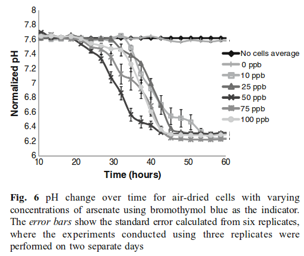

#### [pH-based biosensor for detection of arsenic in drinking water](/papers/pH_based_biosensor_arsenic_drinkingwater.pdf)



#### [Development of a nir fovel biosensor for the detection of arsenic in drinking water](/papers/Edinburgh_Development_arsenic_drinking_water.pdf)
- World Health Organization recommended limit is 10 ppb or [10 $\mu$g/litre](http://www.who.int/mediacentre/factsheets/fs372/en/)
- Sensor can detect 5 ppb, albeit with a caveat
 - You must wait 500 minutes before the Output Dynamic Range between 0ppb and 5ppb goes above .1pH
##### pH vs Time:


#### [Optimization of pH sensing using silicon nanowire field effect transistors with HfO2 as the sensing surface](/papers/NanowireFET_Nanotechnology.pdf)


#### [Realizing the potential of synthetic biology](/papers/nrm3767.pdf)

#### [Engineering E Coli to see light](/papers/Engineering_EColi_tosee_light.pdf)

#### [Spatiotemporal control of cell signalling using a light-switchable protein interaction](/papers/Spatiotemporal.pdf)

#### [A Synthetic Genetic Edge Detection Program](/papers/Synthetic_edge_Detection.pdf)

#### [Combining microfluidics and synthetic biology](/papers/Microfluidics_and_SynBio.pdf)

#### [Sensors for Micro Bio Robots via Synthetic Biology](/papers/uBioRobots.pdf)

#### [Microfluidic Large-Scale Integration](/papers/thorsen2002.pdf)
- Review paper for the state of the microfluidic art in 2002
> A key component of these networks is the fluidic multiplexor, which is a combinatorial array of binary valve patterns that exponentially increases the processing power of a network by allowing complex fluid manipulations with a minimal number of inputs.


> On the basis of the utility of these examples, we believe that other concepts developed for electronic integrated circuits can be usefully transferred to chemical and biochemical analysis and processing in microfluidic devices

#### [A Synthetic Multifunctional Mammalian pH Sensor and CO2 Transgene-Control  Device](/papers/Mammalian_pHSensor.pdf)
- Device pitched as a treatment for diabetes
> Life operates...within a narrow biochemically permissive range (e.g., pH
> 7.35-7.45 in humans

#### [Abstraction Layers for Scalable Microfluidic Biocomputers](/papers/Abstraction_Layers.pdf)

#### [Tuning Response Curves for Synthetic Biology](/papers/Tuning.pdf)
> Synthetic biology includes a concerted effort to formalize an engineering discipline suitable for the design and implementation of novel biological systems.

- Biology operates in a noisy environment
- Response curve defined by a single first order differential equation, which is a highly approximate model based on "empirical observations" 

#####Hill Function

$$\theta(x)=\frac{x^n}{K^n+x^n}$$

- $x$ = unbound ligand concentration
- $\theta(x)$ = avg fraction of binding sites occupied by an input ligand as a function of unbound ligand concentration.
- $K$ = The Hill constant. Rough indicator of the level of ligand concentrations needed to induce saturation ($x \gg K$)
- $n$ = The Hill coefficient. **The larger the value of $n$, the steeper the slope of the Hill function**
 - $n > 1$ indicates cooperativity, where affinity increases in the presence of previously bound ligands
 - $0 < n < 1$ indicates negative cooperativity, where affinity is reduced
 - $n = 1$ indicates a noncooperative reaction


#####Equation for Protein Expression

$$\frac{dy}{dt}=k' + k \left(\frac{x^n}{K^n+x^n} \right)$$

- $y$ is the concentration of the protein being expressed
- $k'$ is the basal rate of production
- $k$ is the maximum additional production rate arising from up-regulation
- $\left(\frac{x^n}{K^n+x^n} \right)$ is the increasing sigmodal Hill function

Equation for Protein Repression

$$\frac{dy}{dt}=k'+k\left(\frac{K^n}{K^n+x^n}\right)$$

- $k'+k$ is the basal expression rate
 - $k'$ accounts for the fact that complete repression may not be possible
- $\left(\frac{K^n}{K^n+x^n}\right)$ is the decreasing sigmodal Hill function

#####Types of Tuning


- **Vertical Scaling** 
 - Change the promoter-gene copy number
   - Multiplies the rate at which mRNA is produced and therefore translated
 - Change RBS strength
 - Codon optimization
- **Vertical Shifting**
 - Introduce or tune a constitutive (always on) source of output $y$
- **Vertical Extension**
 - Up-Regulation: Tune the activation potency of bound TF protein 
 - Down-Regulation: No known single-step method (excluding $k'=0$ case, which is identical to vertical scaling)
- **Leakage**
 - Up-Regulating: Leakage is that which is always active
   - No known direct method
 - Down-Regulating: Leakage is that which cannot be repressed
   - Vary the repression strength of each bound TF protein 
- **Horizontal Scaling**
 - Tune the Hill constant $K$ (increasing $K$ scales curve to the right)
   - $K$ is related to the effective binding affinity of the input signal to the process
 - Tune the binding affinity of the TF to the promoter
- **Steepness**
 - Tune the Hill coefficient $n$ (increasing $n$ leads to increasing steepness)
 - _Ultrasensitivity:_ A biochemical process that has a steep or switch-like steady-state response curve
 - Requires adjusting the effective binding cooperativity
   - Implies the cooperative binding of multiple TFs to the same promoter
- **Dynamic Range**
 - The observable space between uninduced and fully saturated induction

### [CAD for Microfluidic Chips Based on Multilayer Soft Lithography](/papers/soft_litho_CAD.pdf)
> A second difference between electronic CAD and microfulidic CAD is the fast turn-around time in manufacturing microfluidic chips.

I argue that prototyping using FPGAs is significantly faster than manufacturing microfluidic chips.

### [Recent developments in microfluidic large scale integration](/papers/Recent_uF_Developments.pdf)

- A programmable uF platform has kind-of been investigated, albeit just for mixing and processing via fluorescent derivatization.
 - [Digitally programmable microfluidic automaton for multiscale combinatorial mixing and sample processing](/papers/Programmable_uF_automaton.pdf)
   - The review paper quotes the shortcomings of the device as: 
> larger hybrid PDMS/glass valve technology differentiates itself from mLSI and is more suitable for microliter scale fluid volue processing (the chamber volume is 120 nL); moreover this technology requires one external valve per chamber and it seems unlikely that any reduction is possible
- On second glance, an FPGA-like uF platform has been done...damn:
 - [A software-programmable microfluidic device for automated biology](/papers/FPGA_uF.pdf)
- And again...This time using a combination of flow based and electrowetting-enabled droplet based uF
 - [A programmable droplet-based microfluidic device applied to a multiparameter analysis of single microbes and microbial communities](/papers/Programmable_electrowetting_uF.pdf)
>This is largely due to the prevailing para-digm in microfluidic research in which devices are“hardwired” for specific fluid handling tasks, necessitating a customized design for each application or change in protocol. This application-spe-cific approach requires iterative cycles of device design, fabrica-tion, and testing, presenting a major obstacle to the development of new applications and limiting user adoption and community access. In analogy to how programmable integrated circuits en-abled a broader community of developers and nonexpert users,the advancement of programmable microfluidic devices standsto dramatically enhance the pervasiveness and impact of micro-fluidic systems (15)
- **Idea**: what if you combine MHDL with an actual chip by building a Place-and-Router?
 - or what if you built a programmable mLSI chip that could be addressed by MHDL, or a subset thereof?
- **This doesn't seem to have been investigated!**
 - The electrowetting device uses a LABVIEW program to control the chip
   - [Methods used to make device](Methods_ProgramElectrouF.pdf)
 - The claimed FPGA-like devices uses Visual Basic to address the solenoid elements
- The evolution of the FPGA began with the HDL, not the other way around...right?
###Microfluidic Hardware Description Language (MHDL)
- MHDL is a specification language for mLSI chip architectures, as opposed to assay specification. An assay specification language compatible with MHDL is
Biocoder as shown in this paper: [Automatic Synthesis of Microfluidic Large Scale Integration Chips from a Domain-Specific Language](/papers/MHDL_Synth.pdf)
- Introduced here: [Design and Verification Tools for Continuous Fluid Flow-based Microfluidic Devices](/papers/MHDL.pdf)

#Characterization
###[Optogenetic characterization methods overcome key challenges in synthetic and systems biology](/papers/Tabor_OptoChar.pdf)
>Component signal processing properties, such as the relative amplitude (gain) and time delay of output relative to input for various signals, are captured using **phenomenological**, or 'black box' mathematical models. The models are used to reliably assemble components into circuits with more advanced capabilities, such as band-pass filters or amplifiers, and eventually into complete systems, such as computers or radios

- i.e. Derive models from experimentation, NOT FROM BIOLOGICAL THEORY!

>Given sufficient measurements, one should be able to formulate a mathematical model that accurately predicts receptor outputs for input signals that have not been tested. Because the only purpose of the model is to predict receptor I/O, a black-box model will typically be preferred over a more complicated version reflecting the receptor molecular biology. Once it is parameterized with experimental data, the model can be used to simulate the receptor response to a wide range of different inputs in silico, thus enabling the computational design of effector signals capable of driving biological signals with desired quantitative and temporal features and satisfying challenge two. Additionally, if receptor outputs can be measured using fluorescent proteins in real time, an in silico feedback controller can adjust the designed input signal to account for any deviations from the model prediction


##[Evolution Paper](/papers/Evolution.pdf)

##[Synthetic Biology and the Art of BioSensor Design](/papers/ApplicationsSynBio.pdf)

##[Biosensor for Direct Determination of Organophosphate Nerve Agents using Recombinant E.Coli](http://pubs.acs.org/doi/full/10.1021/ac9805201)


##[Analog Synthetic Biology](/papers/Analog_Synbio.pdf)
> Nevertheless, we must not forget that digital computation has not offered an effective paradigm for computing efficiently and precisely with noisy and unreliable devices; that multi-logic-gate computations can impose significant metabolic or toxicity burdens on cells owing to their need to use a lot of parts and power; that the fact that there are five to six orders of magnitude fewer genes per cell than digital transistors per chip means that using genes to only perform logic is likely not an efficient way to attain high complexity; that a library of ‘digital parts’ with good on–off ratios, low standby power consumption and low crosstalk does not exist in biology; that the computing basis functions in cells are not really logic functions and abstracting them as such compromises computational efficiency; and that logic basis functions are not the only universal computation primitives.

- No static discipline? Don't just make one up that doesn't work the same way in cells as it does in computers!

> The ‘1’s and ‘0’s of today’s digital computers are useful abstractions of the analog signals in cells, but are often an oversimplification.

- If digital abstraction can't be used to create a working system, then it isn't digital abstraction!
> Furthermore, as in analog circuits, the wiring of the output of one circuit to the input of another leads to ‘loading’ interactions that degrade overall function and prevents simple modular digital abstractions from being effective [13].

- Figure 1b allows you to focus on a ```protein input protein output```point of view


##[Voigt Nor Gate](/papers/voigtNORGate.pdf)

# Cell to Cell communication applications
- [ Spatial Structure Facilitates Cooperation in a Social Dilemma: Empirical Evidence from a Bacterial Community](/papers/felix2013.pdf)
- GASP = Growth Advantage in Stationary Phase
> The fact that cooperation is simultaneously ubiquitous and fragile, begs for an explanation regarding its emergence and maintenance.
> E. coli bacteria collectively restrain growth to avoid population collapse when resources become scarce [21]–[23]. The collective decision to restrain growth before all resources are depleted is a form of altruistic cooperation, and one can think of the entry into stationary phase as a social contract: a collective rule of density-dependent growth regulation [9], [24]. The long-term benefits of going into stationary phase are evident: by limiting population growth, bacteria ensure that enough resources will be available to maintain a viable population for an extended period, and survive until conditions improve and growth can be resumed. In the short term however, ‘cheater’ cells that ignore the collective decision to restrain growth and that utilize the scarce resources to proliferate instead of investing in maintenance, may increase in numbers. As a result, cheaters jeopardize the survival of the collective – which in turn could face a tragedy of the commons [25].
In a Prisoner's Dilemma, the Sucker's payout is negative for their model (only look at the sign of the payoff differences) to work; in a Snowdrift regime the Sucker's payout is positive). 
